# SIMULATOR

In order to have an accessible tool to test the controllers and to visualize the behavior of the drone, i.e. a fast simulation environment, a Matlab simulator was developed. An object oriented approach has been chosen because it provides a clear modular structure and because it makes easier to organize the programs, so one can maintain and modify the existing code and add new objects easily. The organization of the different objects that have been implemented can be found in the Figure 5 1. Each of the objects is described on the next paragraphs. 

 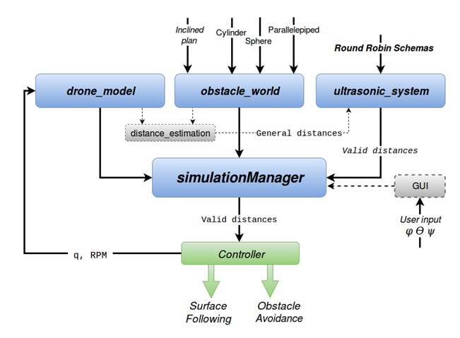
 

Figure 5 1 Simulation Object Schema

## Drone_model object

The model of the drone has been divided in two parties, which are shown in the Figure 5 2, the inner loop (angle closed loop model, which links the reference for the angles and the angles that are effectively applied to the mathematical model) and the outer loop model (angle/speed model, which links the angles in the simulation to the position and velocities).

 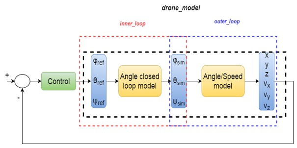
 

Figure 5 2 Simulation, drone model-control loop

### Inner loop, angle “black box” model

The inner loop part of the model has been modelled with a first order approximation with a fixed gain. The Figure 5 3 and equation (5 1) show how the model is implemented. This part is done because the angles, when they are commanded for the drone, are not reached immediately. The comparison between what happens in reality with what the simulation actually does can be seen in the Figure 5 4. The figure shows in fact the first order approximation between the angles of reference and the euler angles of the drone, at left the simulation and at right the reality. The red curve is the reference while the blue one describes the evolution of the angle.

 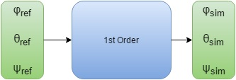
 

Figure 5 3 Inner loop model

euler angle[k]=euler angle[k-1]+K*(euler angle[ref]-euler angle[k-1])	(5 1)

 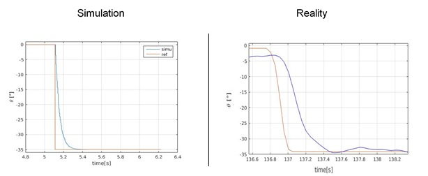
 

Figure 5 4  First order approximation between the angles of reference and the euler angles of the drone, at left the simulation and at right the reality

# Outer loop, angle-speed model

The outer loop part of the model links the velocities in the drone’s frame and the actual euler angles. The equations (5 2), (5 3) and (5-4) are the mathematical relations considered for this point of the model, (u,v,w) are the velocities in the axis specified in the frame of the Figure 5 5.

 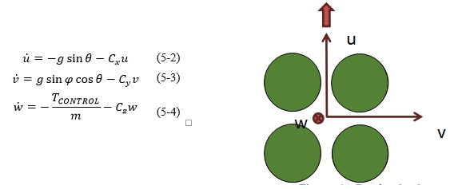
 

Figure 5 5 Drone (body) frame, the upper arrow represents the head of the drone

A comparison between the simulation and the reality when a step in the pitch is applied with its respective result is shown in the Figure 5 6. One can see that the velocity does not converge at the same point in the two cases. This could be explained with the perturbations, like the wind, that one has in the real test.

 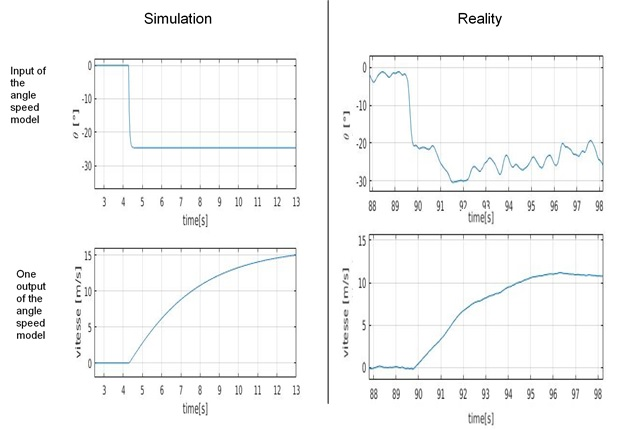
 

Figure 5 6 Outer-loop, angle speed model comparison between the reality and the simulation

## Obstacle world object

The creation of the obstacles is done in this object. The object lets to define some geometrical forms and essentially define the position, dimensions and draw them in the world. Each type of obstacle is defined with an array organization so it easier to manipulate them when there are many.  The Figure 5 7 shows the way the object is organized.

 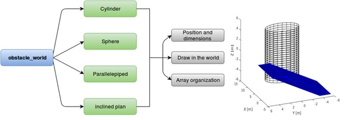
 

Figure 5 7 Obstacle object organization

## Distance estimation

The simulation of the information given by the ultrasound sensors is done mathematically. The position and orientation of the drone (or head in the surface following case) is considered to define a vision line direction for each sensor. The equations (5 5), (5 6) and (5 7) show how this vision line can be defined. The Figure 5 8 shows the vision line that relies the drone and the obstacle. Then, an intersection point between this line and each of the obstacles previously defined in the obstacle object can be calculated. The director vector is a unit vector so the distance can be estimated just looking into the λ parameter. The array organization of the obstacles makes easier the examination of all the obstacles. Once the candidate point is known, it is tested so it is inside the geometric figure defined, the angle between the normal vector and the line vision is also tested so it is no greater than 27.5° and then it can have a behavior near to reality. Indeed, this last number comes from the datasheet of the sensor where the cone of vision has an angle of 55°. The Figure 5 8 shows graphically which angle is being considered in order to simulate the angle of the cone. For each sensor the minimum of all the distances measured is returned by this module . 

 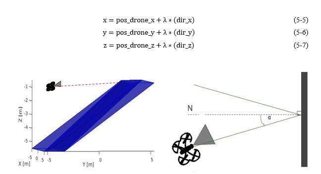
 

Figure 5 8 At left and in red the line vision of the drone that intersects the obstacle. At right alpha (the angle between the normal of the surface and the vision line) should be no greater than 27.5° to have a valid measure. 

In fact, the line vision for the front sensor can be defined independently of the angles of euler of the drone in order to simulate the two degrees of freedom of the head of the drone. In occurrence, the simulation for surface following has been done considering that the head is always aligned to the normal vector of the surface. This assumption will be explained in detail in the paragraph of the simulation for the 3D surface following. 

## Ultrasonic system object

Some of the specifications that were considered for the ultrasonic sensor are
•	5 ultrasonic sensors, with a field of view of 55°
•	US system CPU occupancy should not exceed 1 core of the main CPU, under the circumstance of having 2 sensors measuring distance at the same time. There exits in fact two US partitions, at the same time the drone can only use two sensors from the same partition.

 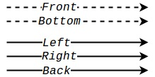
 

Figure 5 9 US partitions 

•	Range ∊ [0.6 m, ~5 m]
•	Limitation in speed to avoid Doppler effect  vmax  = 4-5 m/s
The organization of the object is shown in the Figure 5 10. In the RR mode the simulation of the schema and its respective frequency has been implemented so the user can choose between the different round robin schemas that are already working in the drone (Figure 5 11) or test any new possible implementations. The RoundRobin_All uses all the sensors in a defined sequence and the RoundRobin_Front1 uses only the front, right and left sensors. For the simulation of the surface following task only the RoundRobin_FrontOnly was considered. The Active sensors part uses the type of schema and the frequency to validate the measures of the distance estimation part which sends all time what the five US sensors are receiving. As a result it produces a valid distance, these last values will be considered as a simulation of the information received and processes in the simulation.

 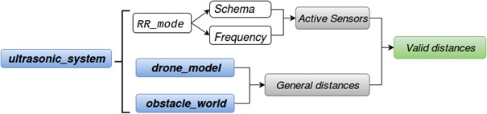
 

Figure 5 10 Organization of the ultrasonic object 

 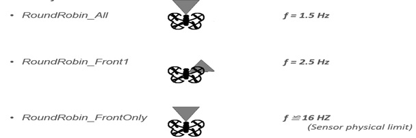
 

Figure 5 11 Available Round Robin Schemas 

## SimulationManager object

The object “simulationManager” is the interface between the objects, drone_model, obstacle_world and ultrasonic_system, (they define the pose of the drone and the exterior world) and the controller that the user wants to test in the drone. It essentially updates the controller, the drone model and the measurement of the distance. This central object also manages the graphical interface which lets the user command the drone in euler angles and thrust and also lets to see the evolution of the drone’s behavior in position, velocity and inclination angles. The graphical interface created by this last object also lets the user fix the round robin (the sequence with which the sensors are active) of the US sensors. This last part is not useful in the surface following project because only the information from the front sensor is considered. The Figure 5 12 shows the organization of the object. 

 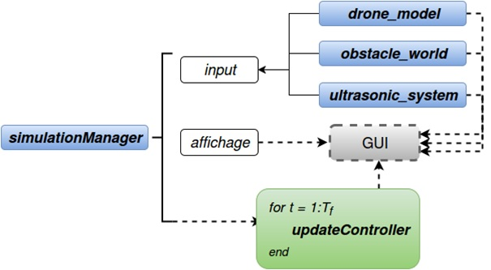
 

Figure 5 12 Simulation Manager Object 

An overview of the graphical interface and a brief description of each tool in the window can be found in the rubric of the Figure 5 13

 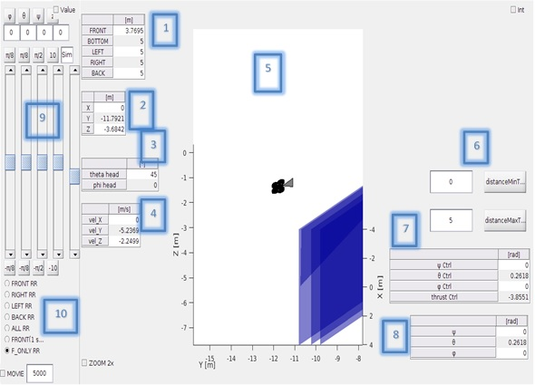
 

Figure 5 13 Overview of the graphical interface of the simulator. 1) Distances returned by the sensors 2) Current position of the drone 3) Angles of the head of the drone 4) Current velocity of the drone 5) The window lets to see the evolution of the drone’s pose and the obstacles 6) Constants that let adjust the values of the range of the sensors 7) The values that the controller returns 8)The current values for the euler angles 9) Slidebars to command the drone in euler angles and in altitude 10)Bottoms to change the Round Robin Schema that the sensors are taken into account to collect  information. 

# Installation 

Clone the whole repository, open RunSimulation.m in matlab and then run it. 

# Some projects done using the simulator

- Hover capability
  
 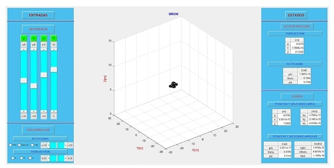
 
- Surface following
  
 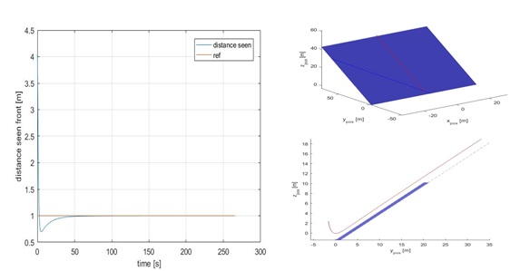
 
- Trajectory planning and control
  
 
 
- Swarm
  
 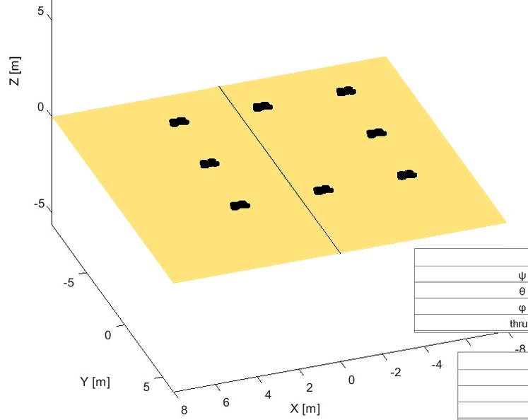

  

